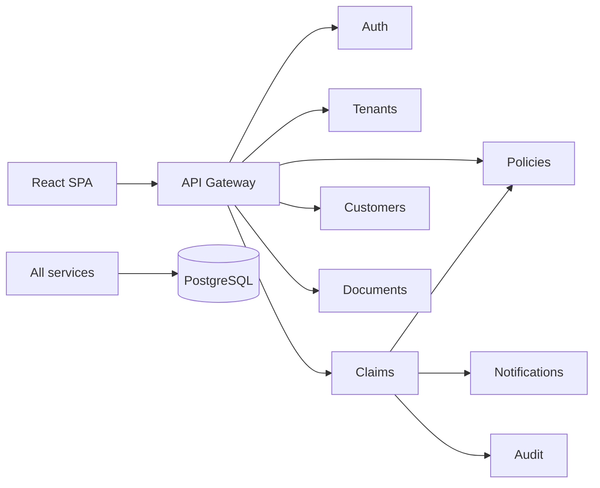

# Architecture audit

Audit date: 2026-09-30. This document records what the repository already does and what the strangler-pattern reference architecture still needs. It is the baseline for contributor issues. Do not reimplement rows marked `IMPLEMENTED`.

## Current system

Claim Center is a hybrid multi-tenant insurance platform. Small tenants share one PostgreSQL database with a Hibernate `tenantFilter`. Large tenants get a dedicated database and `TenantRoutingDataSource`. The React app sends a JWT plus `X-Tenant-Id`. Spring Cloud Gateway routes `/api/**` to nine Spring Boot services. Claim submission validates the policy over REST, scores fraud in-process, then best-effort REST calls notification and audit. Local run is `make start` (`infra/docker/docker-compose.yml`). Deploy target today is Google Cloud: GKE, Cloud SQL PostgreSQL, Artifact Registry (`infra/terraform/gcp`). CI is Maven test, Checkstyle, SpotBugs, frontend lint/build, Trivy, CodeQL, image build, and optional GKE apply.

There is no Kafka, outbox, search index, operating-mode switch, or AWS runtime. Supporting calls are synchronous and fail open: notification and audit errors are logged and claim creation still returns.

## Classification

| Area | Status | Evidence | Do not rebuild |
| --- | --- | --- | --- |
| API gateway | IMPLEMENTED | `services/api-gateway` routes auth, tenants, policies, claims, customers, documents, notifications, audit | A second gateway |
| Authentication and tenant JWT | IMPLEMENTED | `auth-service`, `JwtTenantFilter`, header/token tenant match | A new identity stack |
| Hybrid multi-tenancy | IMPLEMENTED | Shared DB plus dedicated DB for `LARGE` tenants. See `docs/tenant-onboarding.md` | A single-tenant rewrite |
| Claim lifecycle API | IMPLEMENTED | `POST /api/claims`, `POST /api/claims/{id}/decision`, policy coverage check | A parallel claim write API |
| Relational transactional store | PARTIALLY_IMPLEMENTED | PostgreSQL 16 locally, Cloud SQL in Terraform. Schema in `services/common/src/main/resources/db/schema.sql`. Not Aurora | Replacing Postgres for local dev |
| Transactional outbox | MISSING | Claim save, notify, and audit are separate calls. No outbox table | — |
| Kafka / event bus | MISSING | No broker in Compose, no client dependency | — |
| Fraud service | PARTIALLY_IMPLEMENTED | `FraudDetector` runs inside claim-service: amount, coverage utilisation, round amounts, narrative keywords, policy velocity, off-hours timing. Result stored on `claims`. Not a service, not async, no model version | The existing rule scorer |
| Document service | PARTIALLY_IMPLEMENTED | Metadata row and a `storage_key` UUID. No bytes, no object store, no OpenText | The document API |
| Notification service | PARTIALLY_IMPLEMENTED | Sync REST, email channel, persisted row. Claim-service swallows failures | The notification API |
| Audit service | IMPLEMENTED | Sync REST audit log. Failures are swallowed by claim-service | A second audit log for the same action |
| Search service | MISSING | No search index. Elasticsearch is applicable as an optional engine. See below. | The claim tables |
| Integration service | MISSING | No DVLA, address, or OpenText ports | — |
| Batch processing | MISSING | No batch module or scheduler | — |
| Idempotent claim creation | MISSING | New UUID on every `POST /api/claims`. No `Idempotency-Key` | — |
| Business duplicate detection | MISSING | Velocity affects fraud score only. It does not reject or link a duplicate claim | Do not overload idempotency keys for this |
| Kafka partition strategy | MISSING | No topics | — |
| DLQ and replay | MISSING | No consumer pipeline | — |
| Async ML fraud score | MISSING | Score is synchronous and rule-based only | Do not block intake on a model call |
| Fraud backlog recovery | MISSING | No consumer lag, KEDA, or priority fraud topics | — |
| Operating modes | MISSING | No NORMAL / DEGRADED / EMERGENCY / RECOVERY | — |
| Backpressure and rate limits | PARTIALLY_IMPLEMENTED | CPU HPA at 70% (`infra/k8s/hpa/*`), max 8 replicas. No API limiter, no per-tenant limit, no circuit breaker, no pool-aware consumer throttle | The existing HPA manifests |
| Lambda vs ECS placement | NOT_APPLICABLE | Runtime is JVM services on Compose/GKE. Cloud Run is mentioned as an option, not implemented. Do not add Lambda or ECS to local startup | — |
| Search drift and reindex | MISSING | No search index | — |
| Dual-write protection | PARTIALLY_IMPLEMENTED | Application writes to `claims` go through `ClaimApplicationService` only. No DB role split, no CDC safety net for a legacy writer | — |
| Observability | PARTIALLY_IMPLEMENTED | Actuator Prometheus on every service. Grafana panels for latency, 5xx, throughput, CPU, memory (`observability/`). No OpenTelemetry, no correlation IDs, no domain metrics | The existing scrape config |
| Disaster recovery | MISSING | Single-region GKE/Cloud SQL sketch. No RPO/RTO, no failover design | A live multi-region deployment |
| Failure simulation | MISSING | No local fault hooks | — |
| Automated tests for resilience | PARTIALLY_IMPLEMENTED | `FraudDetectorTest`, `AuthLoginTest`, `TenantSlugTest` only | Those tests |
| Reference documentation | PARTIALLY_IMPLEMENTED | `docs/architecture.md`, `docs/deployment-diagram.md`, `docs/sequence-claim-submission.md`, `docs/tenant-onboarding.md`, short README | Those pages. Extend them; do not replace the current-state diagrams with a fictional one |
| Target architecture diagram | MISSING | Current diagrams show REST only | — |
| Redis | NOT_APPLICABLE | Unused. Do not add a cache until a measured read path needs it. Idempotency must not depend on Redis for correctness | — |
| AWS account / Aurora cluster | NOT_APPLICABLE | Deploy target is GCP. Aurora belongs in the DR and trade-off docs as the production relational analogue of the existing Postgres, not as a second local database | — |
| Live third-party credentials | NOT_APPLICABLE | None exist. Keep it that way. Adapters must be mocks | — |

## What already matches the target story

The strangler split has started. Claim intake is its own service. Policy, customer, document, notification, and audit are separate deployables behind one gateway. Tenant isolation is real. Fraud rules already run on the synchronous path and do not call a model. Prometheus and Grafana already scrape the JVM services. Docker Compose and Kubernetes manifests already boot the current topology.

## Gaps that carry the design story

The missing spine is: durable idempotency, a transactional outbox in the same claim transaction, Kafka publication with at-least-once delivery, idempotent consumers, DLQ and replay, and an explicit operating mode that sheds non-critical work. Search, notifications, documents, and ML fraud should become consumers of claim events. Critical fraud rules stay on the request path.

Effectively-once processing is at-least-once delivery plus idempotent consumers plus unique event IDs. Do not document end-to-end exactly-once.

## Elasticsearch applicability

Elasticsearch can be added. It is not a second source of truth, and it is not part of claim intake.

Use it for claim search: narrative text, claim number, status, fraud band, and tenant-scoped filters. The claim row in PostgreSQL remains authoritative. A critical search must be able to fall back to the database when the index is down. Index updates belong on the event path once the outbox exists. Until then, a direct index call from claim-service would be a second write and should not be the design.

The repository is MIT. Do not vendor Elasticsearch server source. Run the official image, and depend on the Apache-2.0 Java API client. Elastic License 2.0 allows this local and self-managed use. It does not allow offering Elasticsearch itself as a managed service.

Keep it off the default `make start` path. A single-node process wants a large heap and, on Linux, `vm.max_map_count`. Put it behind a Compose profile so the current demo still boots. One node is enough for the reference. Do not add a production cluster, Elastic Cloud credentials, or a second observability stack. Prometheus and Grafana already cover metrics. Kibana is optional for index inspection only.

OpenSearch is the alternative if a contributor cannot accept the Elastic License image. The engine task should pick the official Elasticsearch image and keep the client behind an interface so that swap stays possible. Drift detection, reindex, and repair stay in the search-projection issue.

## Local constraints for every issue

- `make start` must keep working.
- Existing tests must keep passing.
- No secrets and no live OpenText, DVLA, or address-provider credentials.
- PostgreSQL remains the local source of truth.
- Do not add Kafka, Elasticsearch, or a simulator until the issue that owns that component.
- Label simulated load results as local. Do not invent production RPS numbers.
