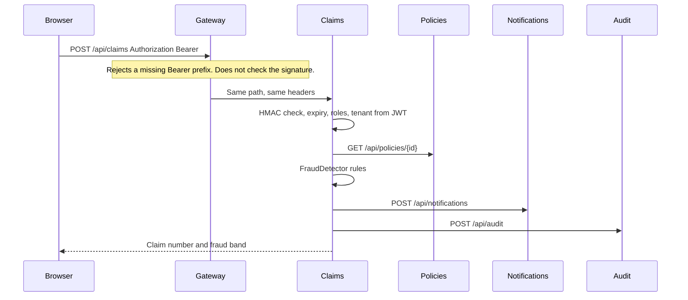

# Current architecture

Date: 2026-09-30. This is the gap analysis for the staff-engineer reference track. It describes the running system. It does not describe Kafka, JWKS, or a search index as if they were already deployed.

The strangler backlog is [epic #3](https://github.com/new-world-coder/claim-center/issues/3). `docs/ARCHITECTURE_AUDIT.md` classifies that backlog. This document classifies authentication, tenancy proof, data-store choice, caching, ADRs, and the interview guide. Work already filed there is linked, not repeated.

## What runs today

Nine Spring Boot services and a React UI sit behind Spring Cloud Gateway. PostgreSQL 16 is the only database. Small tenants share it. Large tenants get a dedicated database at onboarding. There is no Kafka, Redis, Elasticsearch, refresh token, or JWKS endpoint.

| Area | Where |
| --- | --- |
| Gateway | `services/api-gateway`. Path routes in `application.yml`. |
| Auth | `services/auth-service`. Login at `POST /api/auth/token`. |
| Tenants, policies, claims, customers, documents, notifications, audit | `services/*-service` |
| Shared security and tenant routing | `services/common` |
| UI | `frontend/`. Token in `sessionStorage`. |
| Local runtime | `make start` → `infra/docker/docker-compose.yml` |
| Kubernetes | `infra/k8s/base`, CPU HPAs in `infra/k8s/hpa` |
| Cloud | `infra/terraform/gcp`: GKE, Cloud SQL, Artifact Registry |
| CI | `.github/workflows/ci-cd.yml`: Maven test, Checkstyle, SpotBugs, frontend lint/build, Trivy, CodeQL, image build, optional GKE deploy |
| Metrics | Actuator Prometheus, scrape config `observability/prometheus.yml`, Grafana dashboard for HTTP latency, errors, throughput, CPU, memory |
| Tests | `AuthLoginTest`, `FraudDetectorTest`, `TenantSlugTest` |

## Request flow

The gateway chooses the service from the path. `/api/claims/**` goes to claim-service. `/api/documents/**` goes to document-service. There is no `/api/fraud/**` route because fraud scoring is a class inside claim-service, not a service. The JWT does not select the destination. That split is already true and should stay true.

Notification and audit failures are logged. Claim creation still returns. Policy validation failure rejects the claim.

## Authentication flow

Login checks the username and password, then `AuthApplicationService.issue` builds an HMAC JWT (`HS256`) with the shared `JWT_SECRET`:

- `sub` — username
- `iss` — `claim-center`
- `tenant_id`
- `tier`
- `roles`
- `iat`, `exp` (one hour)

There is no `aud`, no `nbf`, no `jti`, no `kid`, and no refresh token. Logout returns a status. It does not revoke the access token.

Downstream services verify that token with `NimbusJwtDecoder.withSecretKey`. That checks the HMAC and the expiry. It does not check issuer or audience, because those validators are not configured and `aud` is not issued. Roles from the `roles` claim become `ROLE_*` authorities. Method security on claim-service limits create and decide.

The gateway filter only checks that `Authorization` starts with `Bearer `, except for `/api/auth/token` and `/actuator`. Any other string is forwarded. Signature validation happens in the downstream service, which must hold the same secret.

Decoding a JWT reads its claims. Validation proves the signature, issuer, audience, and time window. Today the services validate the HMAC and expiry. They do not validate issuer or audience. The gateway does not validate the token at all.

A client-supplied `X-Tenant-Id` is not the tenant of record. `JwtTenantFilter` uses `tenant_id` from the verified JWT. If the header is present and differs, the service returns 403.

## Data flow

Business rows live in PostgreSQL. `services/common/src/main/resources/db/schema.sql` creates tenants, users, customers, policies, claims, documents, notifications, and audit logs. Each business table has `tenant_id`. Hibernate `tenantFilter` adds `tenant_id = :tenantId` for the request. `LARGE` tier tokens switch `TenantRoutingDataSource` to that tenant's database.

Claim creation is one local transaction for the claim row. Policy, notification, and audit calls are separate HTTP calls and are not in that transaction.

Documents store a metadata row and a UUID `storage_key`. No object bytes are stored.

## Event flow

There is no broker. Claim submission does not write an outbox row. Notification and audit are synchronous HTTP. A crash after the claim commit and before those calls drops the side effect. Duplicate `POST /api/claims` creates two claims. Idempotency, outbox, Kafka, DLQ, and replay are tracked on epic #3 (#9, #10, #11, #12). Do not file them again.

## Deployment

Local: Docker Compose, one Postgres, one container per service, Prometheus on port 9090, Grafana on port 3001.

Production shape in Terraform: one GKE regional cluster, one Cloud SQL Postgres instance, Artifact Registry. Kubernetes manifests set replicas and CPU HPAs from 2 to 8 at 70% CPU. CI deploys only when GCP workload-identity secrets exist.

This is single-region. It is not active-active or active-passive failover. Disaster-recovery documentation is #21. Do not claim a local drill is regional DR.

## Current limitations

- The gateway authenticates presence of a header, not the token.
- Every service that validates JWTs needs the shared HMAC secret.
- Issuer, audience, key id, and refresh are absent.
- Access tokens cannot be revoked before `exp`.
- No automated test rejects an expired token, a bad signature, a wrong role, or a cross-tenant read.
- Tenant filters depend on the JWT tenant being set. A query path that forgets the filter would not be caught by a test today.
- No cache, so there is no tenant-prefixed cache key yet. Redis is not required.
- No NoSQL database. Claim transactions need the relational store. Adding a second database only for the diagram would violate the "do not add technology for resume keywords" rule.
- Observability is HTTP and JVM metrics. No tracing, no 401/403/429 counters, no pool or lag metrics.
- CI runs unit tests and static analysis. It does not run a multi-service integration or load suite. Load tests are #23. Do not publish invented latencies.

## Classification

| Enhancement | Status | Already tracked |
| --- | --- | --- |
| Path-based gateway routing | IMPLEMENTED | Keep it. JWT must not become the router. |
| Login, roles, HMAC access JWT, stateless resource servers | PARTIALLY_IMPLEMENTED | — |
| Refresh token, `aud`, `jti`, asymmetric keys, JWKS, gateway validation | MISSING | New issue |
| Issuer and audience checks | MISSING | New issue, with JWKS |
| Tenant from verified JWT, header mismatch rejected, shared vs dedicated DB | IMPLEMENTED | — |
| Cross-tenant tests and `docs/MULTI_TENANCY.md` | MISSING | New issue |
| PostgreSQL as claim system of record | IMPLEMENTED | — |
| NoSQL / Redis as a required store | NOT_APPLICABLE | ADR only. Do not add a database. Idempotency stays in Postgres (#9). |
| Idempotent claim create | MISSING | #9 |
| Transactional outbox and publisher | MISSING | #10 |
| Kafka, partition key, DLQ, replay | MISSING | #11, #12 |
| Timeouts, retry, circuit breaker, bulkhead, rate limit | MISSING | #16. Retries only when the operation is idempotent. |
| Per-tenant gateway limits and 429 metrics | MISSING | #16. Do not open a second rate-limit issue. |
| Actuator, Micrometer, Prometheus, Grafana HTTP dashboards | PARTIALLY_IMPLEMENTED | #5, #20 |
| OpenTelemetry | MISSING | #20 if the extra collector stays optional |
| Failure simulations | MISSING | #22 |
| Disaster recovery design | MISSING | #21. Simulation is not production DR. |
| Load tests | MISSING | #23. Label measured numbers local or CI. |
| Thread-safe O(1) LRU | MISSING | New issue. `ConcurrentHashMap` alone is not an LRU. |
| ADRs 001–008 | MISSING | New docs issues. 004 and 005 must match #10 and #9. |
| Security tests listed in the prompt | MISSING | New issue for what can be tested now. `kid` and audience tests land with JWKS. |
| CI compile, unit test, static analysis, dependency scan, image build | IMPLEMENTED | New tests belong in `mvn test` so this pipeline picks them up. |
| README staff walkthrough | PARTIALLY_IMPLEMENTED | #8 |
| `STAFF_ENGINEER_ARCHITECTURE_GUIDE.md` and `INTERVIEW_WALKTHROUGH.md` | MISSING | New issue |

## Implementation order

1. Gateway JWKS validation, so a bad token dies at the edge and services stop sharing an HMAC secret.
2. Security tests for expired, malformed, and forged tokens, missing auth, wrong role, and tenant spoofing.
3. Cross-tenant access tests. Isolation that is not tested is a claim.
4. Idempotency (#9), then the outbox (#10), then Kafka and DLQ (#11, #12). Effectively-once processing is at-least-once delivery plus idempotent consumers. It is not a broker guarantee.
5. Rate limits, circuit breakers, and bounded retries (#16).
6. Metrics for auth failures, 429s, and the pool (#20), plus correlation ids (#5).
7. ADRs and the interview walkthrough, written so a reader can see what is running and what is only an open issue.
8. The LRU cache as a tested building block. The JWKS cache may use it. Do not add Redis to host it.
9. Failure drills (#22), load tests (#23), and the DR write-up (#21).

Do not add Kafka, Elasticsearch, or a simulator in the auth and tenancy issues. Those components have their own issues.
