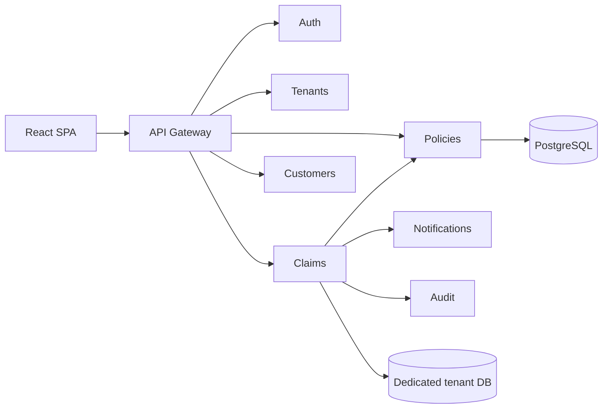

# Architecture

Claim Center is a hybrid multi-tenant insurance platform.

- Small tenants share one PostgreSQL database. Every business table has `tenant_id`, and Hibernate enables a `tenantFilter` from the JWT.
- Large tenants receive a dedicated PostgreSQL database during onboarding. Services route through `TenantRoutingDataSource` when the token tier is `LARGE`.
- The React app stores the access token in `sessionStorage` and sends `Authorization` plus `X-Tenant-Id`. Services reject a header that does not match the token.
- Claim submission calls the policy service, runs fraud screening, then notifies and audits over REST.

