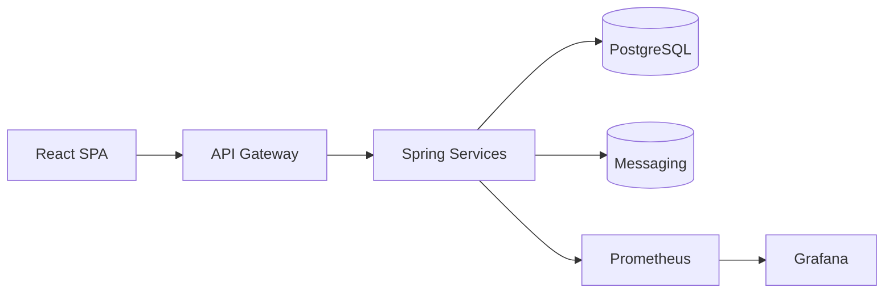

# Architecture

Hybrid tenancy with row-level tenant isolation for shared DB and dedicated DB for large tenants.

```mermaid
graph LR
A[React SPA] --> B[API Gateway]
B --> C[Spring Services]
C --> D[(PostgreSQL)]
C --> E[(Messaging)]
C --> F[Prometheus]
F --> G[Grafana]
```
