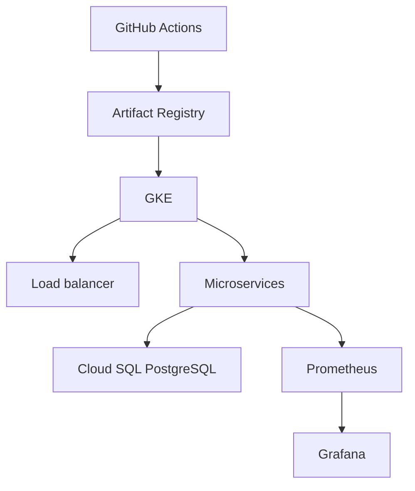

# Deployment

Google Cloud is the deployment target. Vercel is a good host for the React UI alone, but it does not run these Spring Boot services, and Vercel Postgres is no longer a first-party product.

