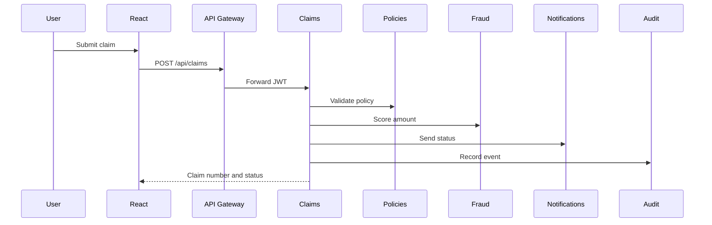

# Claim submission

```mermaid
sequenceDiagram
  participant User
  participant UI as React
  participant GW as API Gateway
  participant Claims
  participant Policies
  participant Fraud
  participant Notify as Notifications
  participant Audit
  User->>UI: Submit claim
  UI->>GW: POST /api/claims
  GW->>Claims: Forward JWT
  Claims->>Policies: Validate policy
  Claims->>Fraud: Score amount
  Claims->>Notify: Send status
  Claims->>Audit: Record event
  Claims-->>UI: Claim number and status
```
