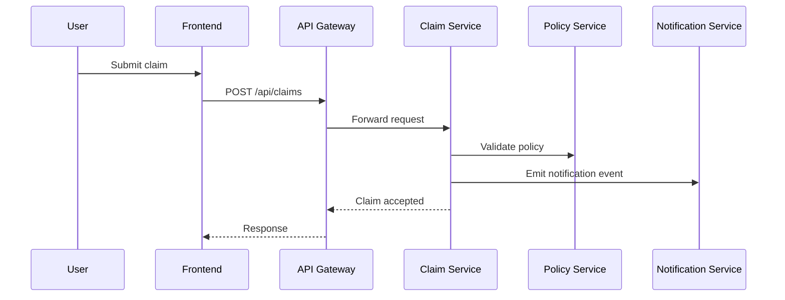

# Claim Submission Sequence

```mermaid
sequenceDiagram
participant U as User
participant FE as Frontend
participant GW as API Gateway
participant CS as Claim Service
participant PS as Policy Service
participant NS as Notification Service
U->>FE: Submit claim
FE->>GW: POST /api/claims
GW->>CS: Forward request
CS->>PS: Validate policy
CS->>NS: Emit notification event
CS-->>GW: Claim accepted
GW-->>FE: Response
```
